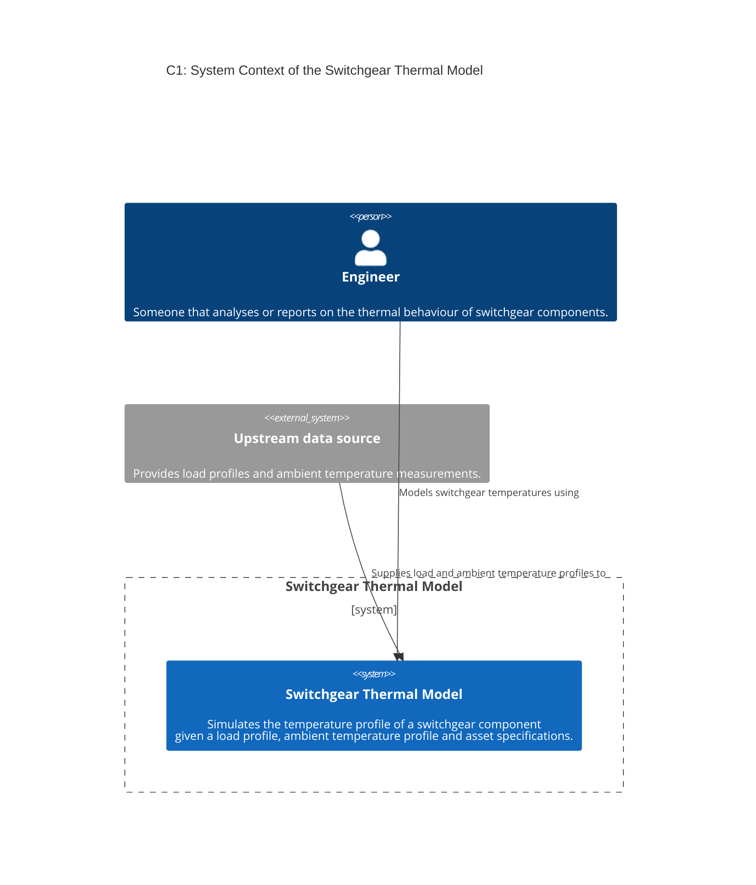
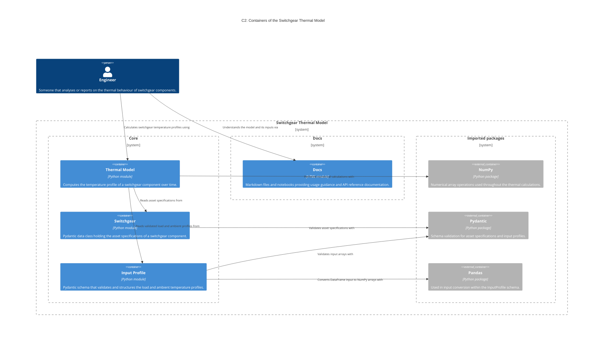
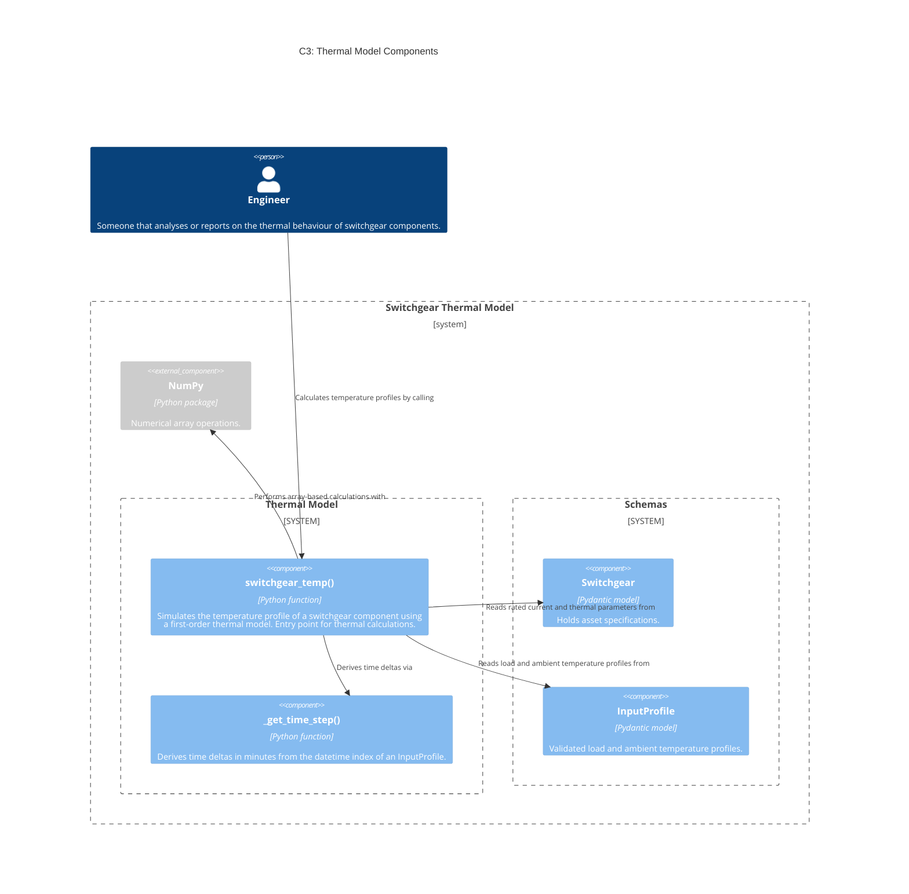
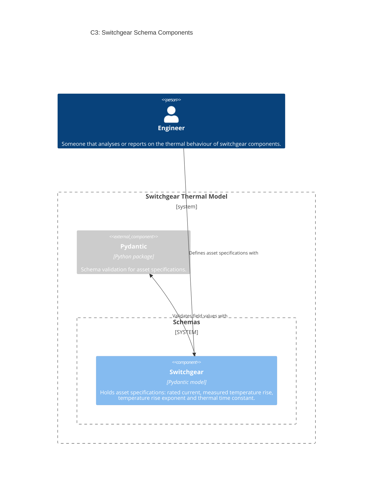
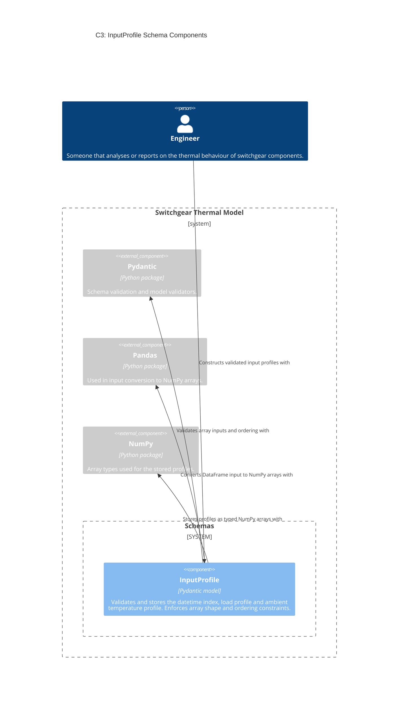

<!--
SPDX-FileCopyrightText: Contributors to the Switchgear Thermal Model project

SPDX-License-Identifier: MPL-2.0
-->

# The architecture of Switchgear Thermal Model

<!-- markdownlint-disable MD013 -->
## System context diagram

## Container diagram

## Component diagrams

### Thermal model

### Switchgear schema

### InputProfile schema

<!-- markdownlint-enable MD013 -->