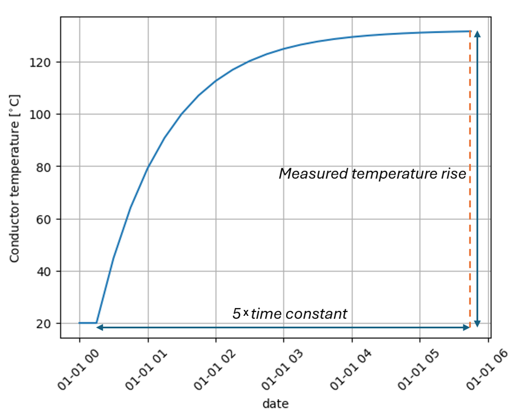

<!--
SPDX-FileCopyrightText: Contributors to the Switchgear Thermal Model project

SPDX-License-Identifier: MPL-2.0
-->

# Determining the switchgear parameters

The thermal parameters (temperature rise, time constant and exponent) are
generally not directly available to DSO/TSO's or other switchgear owners.
If these are unknown or not provided by the Original Equipment Manufacturer
(OEM), a lab experiment can be done.

By performing a lab experiment, these values can be empirically determined. By
placing temperature sensors at critical points in the switchgear, the
temperature can be measured under a constant load of a 100%. Continuing these
measurements until equilibrium is reached, gives is the heating curve of the
switchgear. The time it takes to reach equilibrium is approximately five times
the thermal time constant. This fact can be used to extract this time constant
from the heating curve. A description of the test procedure and example
calculations are provided by the international norm IEC 62271-1 and IEC
62271-306.

The measured temperature rise can be determined by subtracting the ambient
temperature from the measured final temperature in equilibrium state.

{ width="400" }
/// caption
a simple exponential heating curve (under nominal loading).
///

To determine the exponent, a second test is needed to determine the difference
in final temperatures at different levels of constant loading. This can be done
using the formula:

$$
S = \frac{ln(\frac{\Delta\theta}{\Delta\theta_{reference}})}
{ln(\frac{I}{I_{reference}})},
$$

where $\Delta\theta$ stands for the temperature rise in the second test and
$\Delta\theta_{reference}$ for the temperature rise in the reference test. If
the switchgear was tested at 70% and 100%, for example, this formula becomes:

$$
S = \frac{ln(\frac{\Delta\theta_{70\%}}{\Delta\theta_{100\%}})}
{ln(\frac{70\%}{100\%})}.
$$

Note that the exponent is defined in the range between the two load values.
Mostly it is assumed that the exponent is valid outside this range as well.
However, when this range becomes narrow, or the actual load is far from this
range, the validity and accuracy of the exponent value drops.
