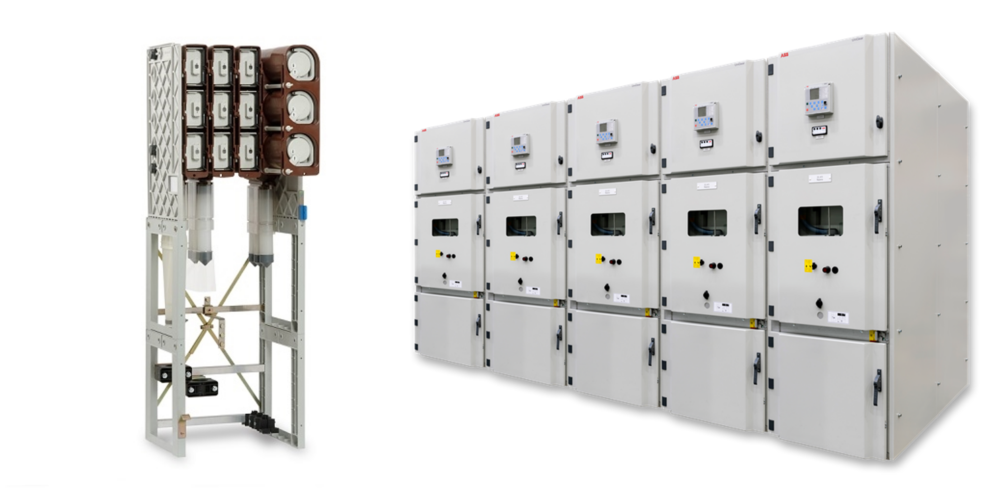

<!--
SPDX-FileCopyrightText: Contributors to the Switchgear Thermal Model project

SPDX-License-Identifier: MPL-2.0
-->

# Model Description

## What is switchgear?

Switchgear is a high-voltage electrical installation that distributes a large,
incoming current flow over a distribution grid at the substation level. It is
organized into bays, which are connected together with a busbar system, which
distributes the load.

Switchgear installations may differ in their physical design, but generally
consist of the same subcomponents, such as busbars, circuit breakers,
disconnectors, current transformers, and similar equipment. These subcomponents
are made from different materials, each with its own specific properties.

Parameters such as the rated voltage, nominal load, and short-circuit capacity
are important when configuring a switchgear installation. These parameters, as
well as other requirements for switchgear, are extensively described in IEC
standards. For example, the temperature rise test, which is part of the type
testing, is defined in the IEC standards. During this test, the installation is
loaded at 100% of the nominal load, and the temperature must remain below the
specified limit.

{ width="400" }
/// caption
Examples of switchgear. Left: Eaton Magnefix (source: eaton.com). Right: ABB
Unigear (source:new.abb.com).
///

## Model Equation

The current model for assessing increased loading of switchgear is derived from
the calculation methods described in IEC 62271‑306. These calculation methods
provide guidelines for determining the loadability of switchgear by accounting
for ambient temperature and heating time.

The equations described in the standard can be rewritten into the equation
below, which is also known as Newton’s law of cooling. This formulation assumes
that the rate of temperature change is proportional to the temperature
difference between the component and its surroundings. In addition, it is
assumed that the heat capacity is not temperature dependent.

$$
\theta[t] = \theta[t-1] + \left(\theta_{a}[t] +
\Delta\theta_{100\%}\cdot\left(\frac{I[t]}{I_{100\%}}\right)^S -
\theta[t-1]\right) \cdot \left(1-e^{-\frac{dt}{\tau}}\right),
$$

where:

- $\theta[t]$ - the temperature at time $t$ in $^{\circ}C$;
- $\theta_{a}[t]$ - the ambient temperature at time $t$;
- $\Delta\theta_{100\%}$ - the temperature rise at nominal load over the ambient
temperature in $K$.
- $I[t]$ - the current in $A$ at time $t$;
- $S$ - the exponent (dimensionless);
- $\tau$ - the thermal time constant in hours;
- $dt$ - the time step size in hours.

This equation is implemented in the
[`switchgear_thermal_model.thermal_model.switchgear_temp`](../api_reference/switchgear_temp.md)
function. through a for loop, which loops over the point in time $t$.
